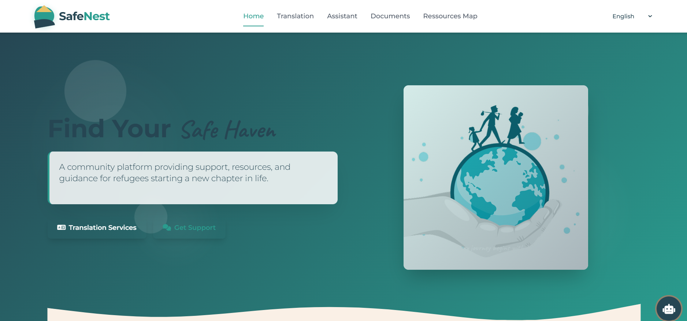
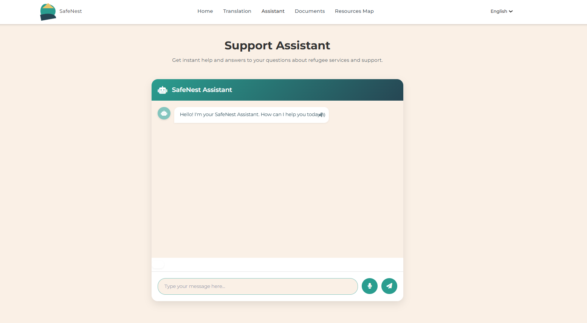
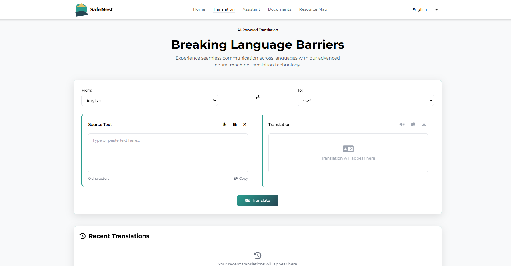
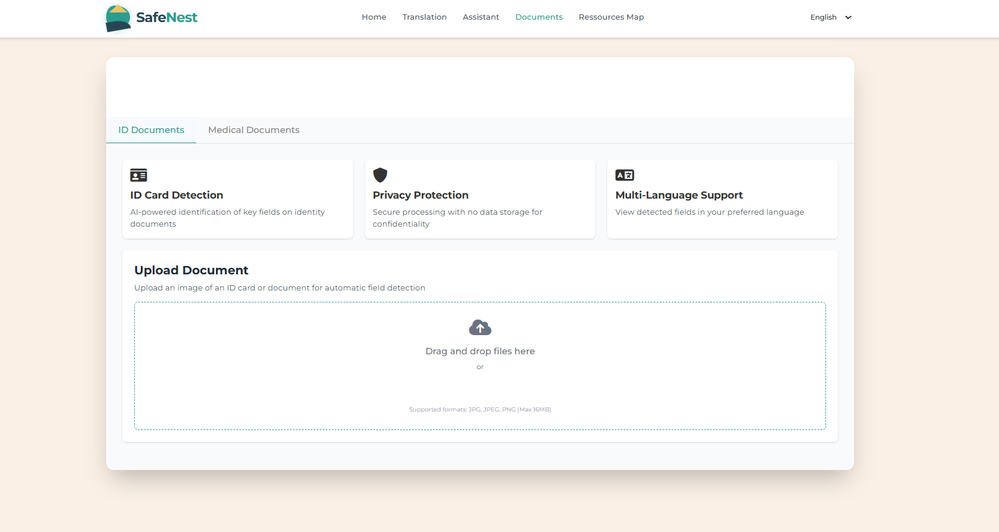
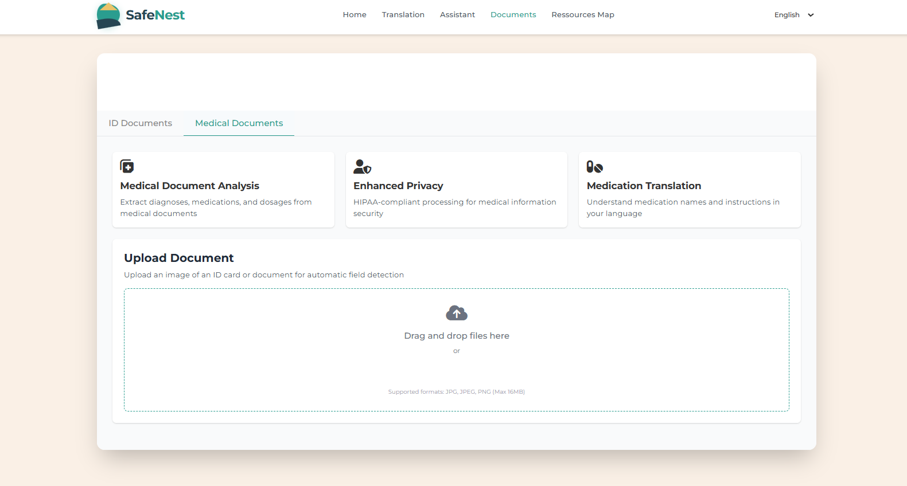

# 🛡️ SafeNest – AI-Powered Refugee Support Platform

**SafeNest** is a humanitarian web platform powered by Artificial Intelligence, developed during my internship with *CodeAlpha*. It is designed to support *refugees* by breaking language barriers and improving access to vital services and information through cutting-edge AI features.
---

## 🌍 Features

- 🔤 **AI Translation** – Real-Time Translation Enables instant voice and text translation between Arabic and European languages to ease communication during medical visits, legal processes, or daily life.
- 🤖 **Multilingual Virtual Assistant (Chatbot)** – A smart chatbot built using *RAG (Retrieval-Augmented Generation)* and the *OLAMA 3.2* model. It answers user queries in multiple languages and provides reliable, real-time assistance.
- 🏥 Document Analysis & Expiry Detection Refugees can upload *ID cards* or *medical documents* to automatically extract key data like *expiry dates*, ensuring timely renewals.(used Yolo8 and fine tuned it with datasets of id cards and medical prescriptions )
- 📍 **Location-Aware Support** – Interactive Localization Map Users can localize themselves on a map to find *nearby shelters*, *schools*, *medical centers*, and more essential services.
- 🧡 **Accessible UI** – Human-centered design, clean interface for all literacy levels
---

## 🖼️ Screenshots

### 🏠 Home Page

### 🤖 Chatbot Interface

### 🌍 Translation Interface

### 🪪 Document Detection Interface (ID Card)

### 🏥 Document Detection Interface (Medical Document)

### 🗺️ Location-Aware Support Interface (Map)

---

## Purpose SafeNest is a humanitarian initiative that empowers refugees by: 
 - Reducing language-based exclusion -
 -  Offering AI-driven guidance -
 -   Simplifying access to documentation and resources -
 -    Connecting them with local support
---
## Tech Stack 
 - *Frontend*: HTML, CSS, JavaScript
 - *Backend*: Django
 - *AI/NLP*: OLLAMA: LLAMA3.2:latest + RAG 
 - *Geolocation*: Map APIs 
 - *Document Processing*: OCR + Expiry Detection
---
## Future work :
  -Upload and Translate : Refugees can upload scanned or photographed documents for automatic translation.
  
  -User Feedback System : Refugees can rate translations to help improve the model's performance over time.

---
## 🙏 Acknowledgements Developed as part of my internship at *CodeAlpha*  
